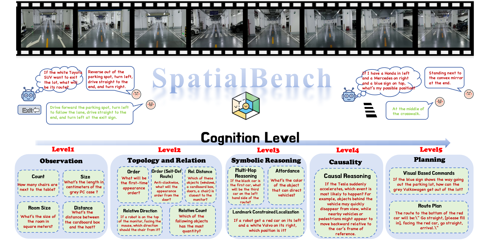

# SpatialBench: A Benchmark for Video Spatial Understanding



SpatialBench is a benchmark suite designed to evaluate the video spatial understanding capabilities of Large Multimodal Models (LMMs). This project uses an OpenAI-compatible API interface to send video frames and related spatial reasoning questions to models, automatically evaluating their response accuracy.

## Features

- **Multi-dimensional Evaluation**: Covers 5 major categories and 15 sub-categories of spatial tasks, including Observation & Measurement, Topology & Composition, Symbolic Visual Reasoning, Spatial Causality, and Spatial Planning.
- **Flexible API Support**: Supports any Vision-Language Model compatible with the OpenAI Chat Completion API (e.g., GPT-4o, Qwen2.5-VL, GLM-4V, etc.).
- **Multiple Testing Modes**:
  - **Standard Evaluation**: Standard QA evaluation using the full dataset.
  - **Deep Guide Mode**: Uses video examples for In-Context Learning (via `QA_fewshot.txt`).
  - **Multi-turn Conversation**: Maintains context to test model performance in continuous interactions.
- **Automated Evaluation**: Provides dedicated scripts to calculate detailed classification accuracy and weighted overall scores.

## Setup

### Prerequisites

Before starting, ensure you have the following installed:
- **Python 3.8+**
- **Git** (Required for downloading the dataset)
  - **Windows**: [Download Git for Windows](https://git-scm.com/download/win). During installation, make sure to select "Git LFS (Large File Support)".
  - **Linux (Ubuntu/Debian)**: `sudo apt-get install git git-lfs`
  - **macOS**: `brew install git git-lfs`

### 1. Install Python Dependencies

After installing Python, install the required libraries:

```bash
pip install openai opencv-python numpy tqdm httpx
```

### 2. Configure Environment Variables

Before running the scripts, you need to set the API-related environment variables.

**Linux / macOS:**
```bash
export OPENAI_API_KEY="sk-your-api-key"
export OPENAI_API_BASE="https://api.openai-proxy.org/v1" # Replace with your API Base URL
```

**Windows (PowerShell):**
```powershell
$env:OPENAI_API_KEY="sk-your-api-key"
$env:OPENAI_API_BASE="https://api.openai-proxy.org/v1"
```

### 3. Download Dataset and Scripts

Due to GitHub file size limits, the video files are hosted on Hugging Face. You can download them using Git.

First, ensure you have **Git LFS** installed:
```bash
git lfs install
```

Then, clone the dataset repository and place the videos in the `dataset/` folder:

```bash
# Clone the Hugging Face repository to a temporary directory
git clone https://huggingface.co/datasets/XPR2004/SpatialBench
```

The directory structure should look like this:
```
SpatialBench/
├── dataset/
│   ├── video_1.mp4
│   ├── video_2.mp4
│   └── ...
├── benchmark_vision_base64.py
└── ...
```

## Dataset Files

The repository includes the benchmark question files (JSON/Text format). **Note: The corresponding video files must be downloaded separately (see Setup step 3).**

- **`QA.txt`**: The standard benchmark dataset containing spatial reasoning questions.
- **`QA_fewshot.txt`**: A dataset variant designed for "Deep Guide" mode, where problems are paired with video examples for few-shot learning.
- **`test_sample.txt`**: A small sample dataset for quick testing and debugging.

## Usage

### 1. Run Benchmark

The main script is `benchmark_vision_base64.py`. It reads the input file (defaults to `QA.txt`), processes videos, calls the API, and saves the results.

**Standard Benchmark (Default):**
```bash
# Uses QA.txt by default
python benchmark_vision_base64.py -m "Qwen2.5-VL-72B-Instruct"
```

**Run Deep Guide Mode (Few-Shot):**
This mode is automatically activated when using the `QA_fewshot.txt` file.
```bash
python benchmark_vision_base64.py QA_fewshot.txt -m "gpt-4o"
```

**Quick Test:**
Run on a small sample to verify your setup.
```bash
python benchmark_vision_base64.py test_sample.txt
```

**Common Arguments:**
- `-w <int>`: Set the number of concurrent worker threads (default is 4).
- `-m <str>`: Specify the model name.
- `--keep-context`: Enable multi-turn conversation mode (default is independent questions).
- `--resume`: Resume from interruption, skipping completed questions.
- `--rerun-incorrect <file.json>`: Rerun only the incorrect questions from a specific result file.
- `--with-reasoning`: Force the model to output its reasoning process (Chain of Thought).

### 2. Evaluate Results

After testing, results are saved in a JSON file within the `*_results` directory (e.g., `QA_results/`). Use `evaluate_benchmark_results.py` to generate a statistical report.

**Usage:**
```bash
# Evaluate a specific results directory
python evaluate_benchmark_results.py QA_results
```

This script generates `evaluation_summary.json`, containing:
- Overall Accuracy
- Weighted Overall Score
- Scores by Major Category
- Scores by Sub Category

## Data Format

The input files (e.g., `QA.txt`) are in JSON format, containing a list of objects. Each object must contain a `sample` field.

**Example Structure:**
```json
[
  {
    "sample": {
      "problem_id": 1001,
      "path": "dataset/video_01.mp4",
      "problem_type": "object_counting",
      "problem": "How many red cups are in the video?",
      "options": ["1", "2", "3", "4"],
      "solution": "<answer>2</answer>",
      "scene_type": "indoor"
    }
  }
]
```

## Project Structure

```
SpatialBench/
├── benchmark_vision_base64.py      # Main benchmark script
├── evaluate_benchmark_results.py   # Evaluation and statistics script
├── QA.txt                          # Standard dataset
├── QA_fewshot.txt                  # Dataset for Deep Guide/Few-shot mode
├── dataset/                        # Directory for test videos
└── README.md                       # Project documentation
```

## Evaluation Logic

The evaluation script calculates scores based on the following logic:
- **Multiple Choice**: Matches the model's output option (A/B/C/D). Correct = 1 point, Incorrect = 0 points.
- **Regression** (e.g., Distance Estimation): Uses the Mean Relative Accuracy (MRA) algorithm. Scores range from 0 to 1 based on the relative error between the predicted value and the ground truth.
- **Weighted Overall Score**: Calculates the final score by weighting different task categories based on their difficulty and importance.

